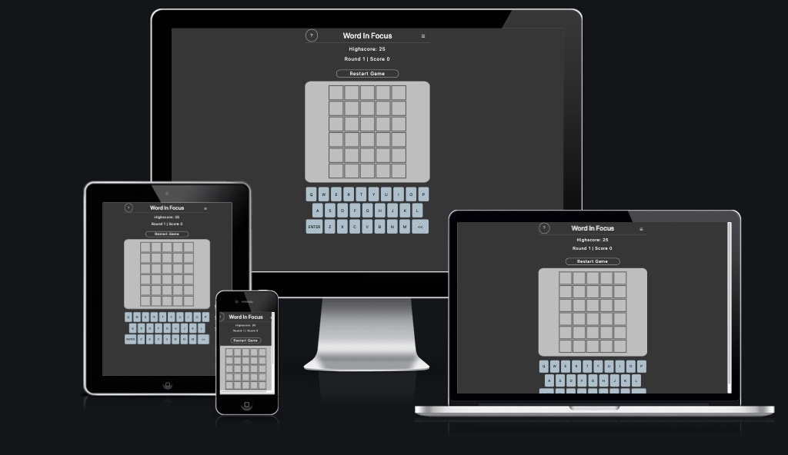
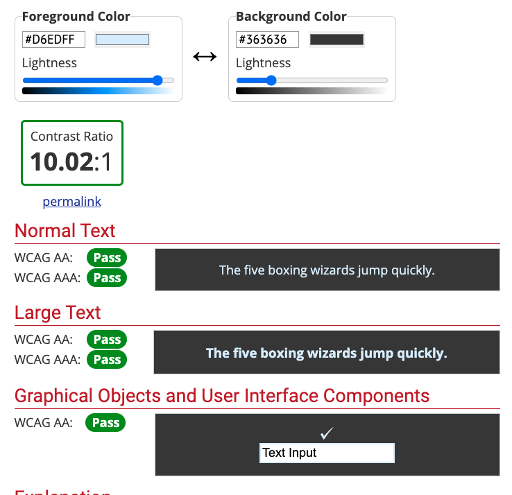
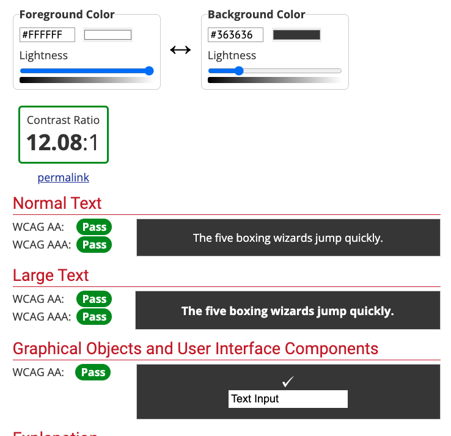
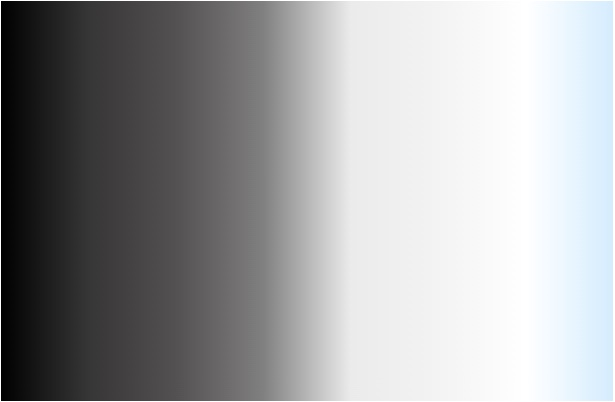

# Word In Focus

---

[Click here to view website on GitHub Pages](https://tizron22.github.io/word-in-focus/).

---

## Table Contents

> 1.  [Overview](#overview)
> 2.  [UX](#ux)
>     1.  [Strategy](#strategy)
>     2.  [Scope](#scope)
>     3.  [Structure](#structure)
>     4.  [Skeleton](#skeleton)
>     5.  [Surface](#surface)
> 3.  [Features](#features)
>     1.  [Existing Features](#existing-features)
>     2.  [Future Feature Considerations](#future-feature-considerations)
> 4.  [Technologies Used](#technologies-used)
> 5.  [Testing](#testing)
> 6.  [Deployment](#deployment)
>     1.  [How this Project was Deployed](#how-this-project-was-deployed)
>     2.  [How to Run this Project in your Browser](#how-to-run-this-project-in-your-browser)
>     3.  [How to Run this Project Locally](#how-to-run-this-project-locally)
> 7.  [Credits](#credits)
>     1.  [Code Snippets](#code-snippets)
>     2.  [Pictures](#pictures)
> 8.  [Acknowledgements](#acknowledgements)
> 9.  [Disclaimer](#disclaimer)

## Overview

**Word In Focus**

Word in Focus is a web game designed to test your memory, select your difficulty and can you beat your highscore?

No game is the same test your english language knowledge and guess the word with no clues other than playing the game.

---

# UX

## Strategy

### Stakeholder Requirements

> #### **External Users**
>
> As a new user, I'd be looking for a game that will test my memory which I'll be able to change the difficulty of from easy to hard to test my abilities based on how I'm feeling that day. A game that will keep me entertained for long periods of time and changes up each time a new game is started, having a count of my highscore to be able to beat would help keep motivation and allow me to beat previous attmepts.

> #### **Site Owner**
>
> As the site owner, I would like a game that caters to the players needs where they would be able to paly for hours on end to beat previous attempts. A game that will use external resources to ensure no two rounds are the same, changing difficulty based on user demand but offers clear signs of when the player is close to the desired outcome.

### User Stories

1. `As a potential new user, I like the site to be user friendly and easily understandable.`
2. `As a new user, I would like to be able to review the instuctions on how to play the game as well as the scoring involved.`
3. `As a current user, I would like to be able to beat any previous highscores set on previous interactions and review these scores.`
4. `As a returning user, I would like a unique experience on each game to keep up on engagement whilst playing.`

---

## Scope

### Requirements

> Easy to Navigate and User Friendly
>
> - Straight forward and uncomplicated view, with the sense of familiarity.

> Reuseability
>
> - Users must be able to re-use this game multiple times with a different experience for each game.

> Rememerable
>
> - Users must be able to remember this site to be able to recommend with friends to increase the number of players.

## Structure

> ### Index Sheet
>
> Included within the header include game instructions, name and button to change the difficulty of the game.
> Within the body to include the Highscore, current round and points available along with a button to restart the whole game if necessary.
> Based on the difficulty selected the amount of rows and columns will be displayed under the restart button.
> Below the game display of the rows and columns will be the keyboard where users will be able to interacte with the game on.

---

## Skeleton

### Wireframes

> - [Index Page Wireframe](./assets/wireframes/index-Desktop.pdf)
> - [Index High Score Pop-Up Wireframe](./assets/wireframes/index-Desktop-HighScore.pdf)
> - [Index How To Pop-Up Wireframe](./assets/wireframes/index-Desktop-Info.pdf)

## Surface

> ### Colour Scheme
>
> When choosing the colour scheme the aim was to ensure the user would not get distracted by the different colours but would also prevent eye strain if the user would be playing for a prolonged time.
>
> The elements were softened by using the transparency of the RGBA as sometimes white of a black screen can be too harsh for the user.
>
> The colours used are:
>
> - Page Background = rgba(54, 54, 54, 1)
> - Game Background = rgba(235, 235, 235, 0.75)
> - Button Colour = rgba(214, 237, 255, 0.75)
> - Button Font Colour = rgba(0, 0, 0, 1)
> - Border Colour = rgba(255, 255, 255, 0.9)
>
> When the colours where selected, I then compared the contrast ratio between the various colors to ensure the site would obtain a [WCAG](https://webaim.org/resources/contrastchecker/) `AAA rating` and to confirm that the content of the site would be easily distinguishable from the background for users.
>
> ## Comparing the background to Gaming area that shows the Tiles
>
> 
>
> ## Comparing the background to the Buttons and Hover styles
>
> 
>
> ## Comparing the background to the Text
>
> 
>
> **Here are all of the colours that were used on the site:-**
>
> 

---

## Features

### Existing Features

> #### Gaming Logic
>
> - [Gaming Logic Wireframe](./assets/wireframes/Logic-Wireframe.pdf)

> #### Game Instructions
>
> - On the left hand side of the logo is a circle with a question mark within, once clicked this will bring up the instructions on how to play the game along with the points awarded each round.

> #### Hamburger Menu
>
> - On the right hand side of the logo is a hamburger menu which is 3 horizonal lines looking like a hamburger, once clicked it will extend the header to show the difficulty options for players to use.

> #### Select Difficulty
>
> - Users once clicking on the hamburger menu, will see a dropdown underneath the header which will allow them to select which difficulty they would like to play at either easy, medium or hard.
> - The default difficulty is set at medium.

> #### Loader Spinner
>
> - When the API is calling or the script is running for a restart of game the loader spinner shows the user that the site is working on the request.

> #### Highscore
>
> - This will show users the current highscore they have achieved out of the most recent games, to be able to compare against with the current round.

> #### Round | Score
>
> - This shows users the current round they are playing on and the score they have achieved so far.

> #### Restart Game
>
> - When the button is clicked the game will restart at the beginning

> #### Gaming Tiles
>
> - This will show the current letter that has been inputted or previous guesses.
> - If the letter is correct and it the right space the tile will turn green
> - If the letter is correct but in the wrong space the tile will change to orange.
> - If the letter isn't in the word the tile will change to grey.
> - Offering live feedback on any submitted guesses along with visual display for the user experience.

> #### Keyboard
>
> - The keyboard at the bottom of the display will allow users to interact with the game, they will either be abvle to select a letter for thier guess, submit thier guess by pressign 'ENTER' or go back to restart thier guess before being submitted.

### Future Feature Considerations

> ### Account / Leader Board
>
> - In any future releases would like to add sign-up and login page to track user highscores to be able to compare performance, by having a leader board users will not only be able to compete against themselves but against other users too.
> - By displaying a leader board we would be able to offer daily, weekly or monthly competitions to generate further use, exposure and potential for sponsers of these events for prizes.

> ### Guess Hints
>
> When users are on last guess in the earlier rounds, would look to add some hints to prompt the next guess to be a correct one.

---

## Technologies Used

> - The project was written in HTML, CSS and JavaScript.
> - The project uses [FontAwesome](https://fontawesome.com/) for the free icons used for web development.
> - The project was written in [Visual Studio Code IDE](https://code.visualstudio.com/).
> - The project was tested utalising [Live Server](https://marketplace.visualstudio.com/items?itemName=ritwickdey.LiveServer) extention in VS code.
> - The project uses [GIT](https://git-scm.com/) for verison control and [GitHub](https://github.com/) as a remote repository.
> - The project uses [GitHub Pages](https://pages.github.com/) for hosting the site.
> - The project's wireframes were designed in [Balsamiq](https://balsamiq.com/wireframes/).
> - The project's HTML was validated using [W3C HTML markup validator](https://validator.w3.org/).
> - The project's CSS was validated using [W3C jigsaw CSS validator](https://jigsaw.w3.org/css-validator/).
> - The project's JavaScript was validated using [JS HINT JavaScript validator](https://jshint.com/)
> - The project's performance and accessibility was tested using [Google Chrome's Lighthouse](https://developers.google.com/web/tools/lighthouse) and [WebAim's W.A.V.E](https://wave.webaim.org/).

---

# Testing

> ## Jest Automated Testing
>
> - Jest was used for automated jesting of some of the JavaScript logic, please refer to the testing documentation below for the results.

> ## Manual Testing
>
> - Manually testing the game throughout development and playing a few rounds on the various difficulty to ensure the site works as intended, please refer to the testing documentation below for the results.

> ## Testing Documentation
>
> - The testing documentation can be found here:- [TESTING.md](TESTING.md)

---

# Deployment

> ## How this Project was Deployed
>
> This project was deployed to GitHub pages via the following steps:
>
> 1. Log into [GitHub](https://github.com/).
> 2. From the list of Repositories then select [tizron22/word-in-focus](https://github.com/tizron22/word-in-focus).
> 3. From the Repository sub-headings then select "Settings".
> 4. Within the settings list underneath "Options" then select "Pages".
> 5. From the dropdown list under the "Source" heading then select "main".
> 6. A second drop-down menu that appears should remain as the default value "/root".
> 7. Press save.
> 8. On Page refresh navigate to the "Pages" in settings and the link to the deployed site should be visibile in a green sub-section with a tick icon next to it on the left.
>
> As this project was created on the main branch all changes made to the repository are shown in the deployed project within a few minutes from being pushed.

> ## How to Run this Project in your Browser
>
> 1. Install the [Google Chrome](https://www.google.co.uk/chrome/) browser.
> 2. Install [GitPod](https://www.gitpod.io/docs/browser-extension/) browser extension.
> 3. Create a [GitHub](https://github.com/join) account.
> 4. Log in to [Gitpod](https://gitpod.io/login/) using your GitHub account.
> 5. Visit Word In Focus [GitHub Repository](https://github.com/tizron22/word-in-focus).
> 6. Open the repository in Gitpod:
>    - Click the green "Gitpod" icon at the top of the Repository, or
>    - Click this [link](https://gitpod.io/#https://github.com/tizron22/word-in-focus).
> 7. A new workspace should open with the current code of the main branch. Any changes made to the main branch after this point will not be updated in your Gitpod workspace automatically.

> ## How to Run this Project Locally
>
> > ### Cloning the Repository
> >
> > 1.  Visit Word In Focus [GitHub Repository](https://github.com/tizron22/word-in-focus).
> > 2.  Click the "Code" dropdown box above the repository's file explorer.
> > 3.  Under the "Clone" heading click the "HTTPS" sub-heading.
> > 4.  Click the clipboard icon or manually copy the text presented: `https://github.com/tizron22/word-in-focus.git`
> > 5.  Open your preferred IDE (VSCode, Notepad++ etc).
> > 6.  Ensure your IDE has support for GIT or has the relevant GIT extension.
> > 7.  Open the terminal and create a directory where you would like the Repository to be stored.
> > 8.  Type `git clone` and paste the previously copied text (`https://github.com/tizron22/word-in-focus.git`) and press enter.
> > 9.  The Repository will then be cloned to your selected directory.
>
> > ### Manually Downloading the Repository
> >
> > 1.  Visit Word In Focus [GitHub Repository](https://github.com/tizron22/word-in-focus.).
> > 2.  Click the "Code" dropdown box above the repository's file explorer.
> > 3.  Click the "Download ZIP" option and this will download a copy of the selected branch's repository as a zip file.
> > 4.  Locate the ZIP file downloaded to your computer and extract the ZIP to a chosen folder to which you would like the repository to be stored.
>
> > ### Opening the Repository
> >
> > 1.  Open your preferred IDE (VSCode, Notepad++ etc).
> > 2.  Navigate to the chosen directory where the Repository was Cloned/Extracted.
> > 3.  You will now have offline access to the contents of the project.

---

## Credits

### Code Snippets

> [Wordle Clone In Javascript - Code with Ania Kubów](https://www.youtube.com/watch?v=mpby4HiElek)
> Some of the logic and thought process used in this video was altered for use within this project.
> [Pressed Effect - GeeksforGeeks](https://www.geeksforgeeks.org/how-to-add-a-pressed-effect-on-button-click-in-css/)
>
> - Code snippet taken on how to create a pressed effect for the restart button.
>   [Jest Dom Display - Ben Kavanagh](https://github.com/BAK2K3)
> - When testing with Jest Issues occured where the DOM wasn't being opened before the test which caused errors with the automated testing.
> - Spoke to Ben provided a solution for the code to work.
>   [Tilt-n-move-shaking Animiation](https://unused-css.com/blog/css-shake-animation/)
> - Code snippet taken for the tiles to shake once an guess was submitted.

---

# Acknowledgements

- I would like to thank my mentor **Ben Kavanagh**, who went above and beyond to support myself when I came across issue with JEST that stopped me moving forward with the project to find a fix and continuously offered support throughout the project duration.

- Thank you to the Slack channel leads _(Old and New)_ who have created the various webinairs to supplement the LMS to improve my abilities and knowledge.

- I would also like to thank my collegeue **Asim Skeete**, who took time out from his day to catch up on with questions I had with JavaScript and was able to relate it to current IDE software I use in my role `SAS Enterprise Guide & VBA in Excel`.

---

# Disclaimer

## **This website is for educational purposes only.**

---
