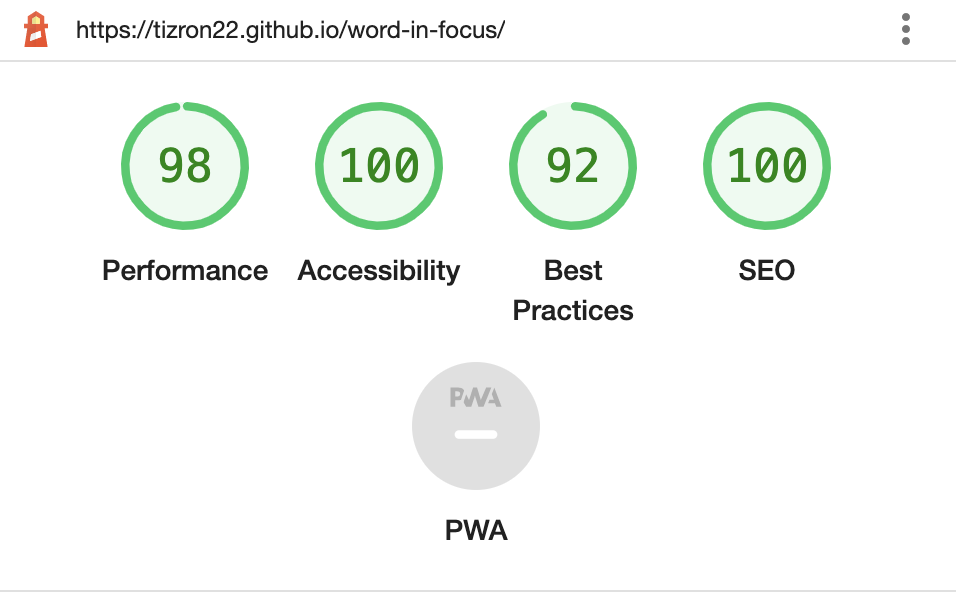
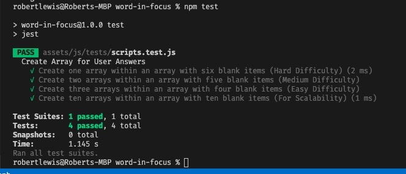

# Word In Focus - `Testing Documentation`

The README documentation can be found here:- [README.md](./README.md)

[Click here to view website on GitHub Pages](https://tizron22.github.io/word-in-focus/).

---

# Table of contents

> 1.  [User Story Testing](#user-story-testing)
> 2.  [Feature Testing](#feature-testing)
> 3.  [Browser Testing](#browser-testing)
> 4.  [Automated Testing](#automated-testing)
> 5.  [Significant Bugs](#significant-bugs)

---

# User Story Testing

> As a potential new user, I like the site to be user friendly and easily understandable.
>
> - The website utilizing familiar icons commonly used on websites such as question mark for infomation and hamburger menu for more options.
> - The website has a simple format which reduces the amount of nose that could distract the user whilst playing.

> As a new user, I would like to be able to review the instuctions on how to play the game as well as the scoring involved.
>
> - When the user clicks on the question mark button, a model opens and covers the screen ensuring the instructions how to play can be read.
> - To close the model the user needs to click either 'x' on the top right corner or 'Lets Play' on the bottom right.

> As a current user, I would like to be able to beat any previous highscores set on previous interactions and review these scores.
>
> - For reoccuring users the highscore is saved to the local storage allowing users to improve on this score, if a highscore is not available on local storage one will be added as 0.
> - If the current score is higher than the highscore, the local storage will be updated with this new score.

> As a returning user, I would like a unique experience on each game to keep up on engagement whilst playing.
>
> - Each game played is unique as random words are pulled from the API, to have the same words appear are highly unlikely and could add to the difficulty as the user can never be sure.

---

# Feature Testing

| Feature                          | Outcome           | Additional Comments                                                                                                                      |
| :------------------------------- | :---------------- | :--------------------------------------------------------------------------------------------------------------------------------------- |
| Game Instructions                | Works as intended | On clicking the question mark icon, it brings up the model and unable to click away until clicking the x or lets paly game buttons.      |
| Hamburger Menu                   | Works as intended | On clicking the hamburger menu the game difficultly radio buttons will either hide or unhide.                                            |
| Select Difficulty                | Works as intended | On clicking either easy, medium or hard radio buttons will reset the game to the desired difficulty but the default is at medium.        |
| Loader Spinner                   | Works as intended | When the code is running the spinner shows to highlight to user that the site is processing the request and switches off once completed. |
| Highscore                        | Works as intended | Upon opening the page, the previous highscore will show and will increase each time the user improves on this score.                     |
| Round/Score                      | Works as intended | When the user is playing a game the round number and score will increase on each successful answer.                                      |
| Restart Game                     | Works as intended | Restarts the game from scratch at the chosen difficulty.                                                                                 |
| Gaming Tiles - `Game Play`       | Works as intended | Shows the number of columns and rows based on the difficulty.                                                                            |
| Gaming Tiles - `Correct Guess`   | Works as intended | When the user submits a correct letter in the right column the tile will turn green to show a correct answer.                            |
| Gaming Tiles - `Close Guess`     | Works as intended | When the user submits a wrong letter and in the wrong column the tile will turn grey to show the letter is not in the word.              |
| Gaming Tiles - `Incorrect Guess` | Works as intended | Shows the number of columns and rows based on the difficulty.                                                                            |
| Keyboard                         | Works as intended | On load of game displays keyboard buttons for the user to click and picks up on actual keyboard input for gaming tiles.                  |

# Browser Testing

    All functionality worked as intended on Safari, Chrome, Firefox and Edge.

    As IE is not supported anymore this has not been tested.

---

# Automated Testing

> Automated testing was completed via the following third party applications:-
>
> - [W3 Markup Validation](https://validator.w3.org/) - For the HTML Vaildation.
> - [W3 Jigsaw](https://jigsaw.w3.org/css-validator/) - For the CSS Vaildation.
> - [JSHint](https://jshint.com/) - For the JavaScript Vaildation.
> - [Google Lighthouse](https://developers.google.com/web/tools/lighthouse) - For Performance, Accessibility, Best Practices, SEO and Progressive Web Apps.
> - [WAVE](https://wave.webaim.org/) - For Accessibility.

1.[W3 Markup Validation](https://validator.w3.org/) - Testing

    Document checking completed. No errors or warnings to show.

2.[W3 Jigsaw](https://jigsaw.w3.org/css-validator/) - Testing

    Congratulations! No Error Found.
    This document validates as CSS level 3 + SVG !

3.[JSHint](https://jshint.com/) - Testing

    No issues other than warnings regarding ES6+ such as const, let and arrow functions.

4.[Google Lighthouse](https://developers.google.com/web/tools/lighthouse) - Testing

5.[WAVE](https://wave.webaim.org/) - Testing

    Congratulations! No errors were detected! Manual testing is still necessary to ensure compliance and optimal accessibility.

> ### Automated testing was also completed using JEST.js.
>
> - [JEST](https://jestjs.io/) - For automated script testing.
> - Due to the last minute change to the assessment criteria with adding Jest Automated Testing, if I have more time to thoroughly research the jest documentation and seperate tests for practice.
> - I would have liked to run more comprehive testing to ensure majority of the functions pass automated testing before releasing to the stakeholder.
>
> 

---

# Significant Bugs

> ### Jest Mock DOM not loading
>
> - When initially running through JEST tests, a `TypeError: Cannot read properties of null (reading 'value)` showed before any testing commenced.
> - The beforeall funtion was added to create a mock DOM before any tests, this was ignored and the DOM was not available when the function was being pulled into the test environment.
> - Speaking to my Mentor `Ben Kavanagh`, he had a resolution of putting the require script within the beforeall after the dom was available which fixed the issue.

> ### Answer not being assigned from wordArry
>
> - When attempting to assign the answer from the wordArray that was created from the API, the answer came back as undefined as the code was running too fast.
> - Had a catch up with a collegeue `Asim Skeete` where we discussed the issue and he gave examples of how to fix the issue, multiple resources were sent over and we discussed how the code was running on the site.
> - After looking at examples following the discussion, using the JS async function resolved this issue and took a few attempts to obtain the needed results.

> ### On-click methods on Index causing errors
>
> - Futher down the line when manual testing an error occured with the onclick function on the index page, to remove this error I changed the code to apply an event listener in the JS code rather than adding it in the index sheet.
> - Not sure what caused the issue but changing to an event listener applied in the code brought it inline with how the code was being written.

---

The README documentation can be found here:- [README.md](./README.md)

---
